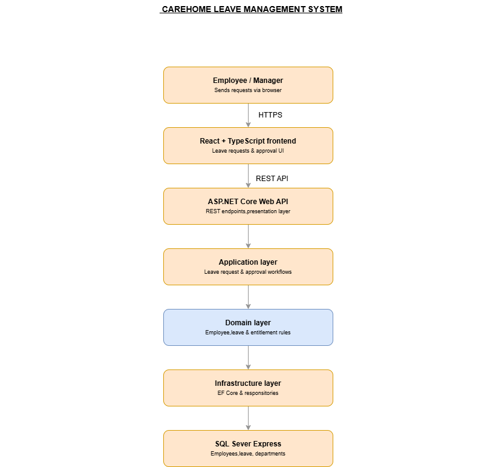

# Architecture Document

| Project Name	|	CareHome Leave Management System |
| --- | --- |
| Version | 1.0 |
| Database | SQL Server Express |
| Backend	|	ASP.NET Core Web API |
| Frontend	|	React + TypeScript |
| Architecture Style	|	Clean Architecture |
| Prepared By	|	Chinnu Rajan |
| Date |	04 August 2026 |

## 1. Introduction
### 1.1 Purpose 
This document describes the software architecture of the CareHome Leave Management System, a web-based application designed to support annual leave management within a care home environment. It explains how the React+ TypeScript frontend, ASP.NET Core Web API, application and domain logic, and SQL Server database work together to support key processes such as leave submission, approval, employee management, and leave entitlement calculation. 
This document also describes the architectural decisions, system layers, security approach,  and   communication between the main components of the system.
### 1.2 Scope 
The CareHome Leave Management System is designed to manage annual leave within a care home environment. The system supports two main user roles: Employees and Managers. 
Employees can view their leave entitlement, submit annual leave requests, view the status of their requests, and review their leave history. Managers can review employee leave requests and approve or reject them based on the available leave entitlement and applicable leave rules. 
The system also provides management functions for maintaining employee information,  leave types, and leave entitlement. The application uses React + TypeScript for the user interface, ASP.NET Core Web API for the backend services, and SQL Server Express for persistent data storage. 
The current scope focuses on the core annual leave management process. Features such as payroll integration, external HR system integration, and production cloud deployment are outside the scope of the current version.
## 2. Architecture Overview 
### 2.1 Architecture Style
The CareHome Leave Management System uses Clean Architecture with a layered structure to separate the user interface, application workflows, business rules, and technical infrastructure.
The system is organised into the following layers:
#### Presentation Layer
The presentation layer consists of the React + TypeScript frontend and the ASP.NET Core Web API controllers. The React application provides screens for employees and managers to perform leave-related activities. The Web API exposes REST endpoints that receive requests from the frontend and return the required data.
#### Application Layer
The application layer contains the workflows required by the leave management system. These include submitting a leave request, retrieving an employee's leave balance, viewing leave history, approving or rejecting leave requests, and managing employee and department information. 
This layer coordinates the operations required to complete each use case without containing database-specific implementation details.
#### Domain Layer
The domain layer contains the core business concepts and rules of the application. Key domain concepts include Employee, Department, Leave Request, Leave Type, and Leave Entitlement. 
Business rules related to leave management, such as validating a leave request against the employee's available entitlement and controlling the approval status of a request, belong in this layer. 
The Domain layer does not depend on React, ASP.NET Core, Entity Framework Core, or SQL Server. This keeps the core leave-management rules independent from technical implementation details.
#### Infrastructure Layer
The Infrastructure layer provides the technical implementation required by the application. It uses Entity Framework Core to communicate with SQL Server Express and handles persistence of employees, departments, leave requests, leave types, and leave entitlement data. 
It also contains implementations of infrastructure-related services used by the application, such as authentication and data access.
#### Dependency Direction
The dependencies are arranged so that the Domain layer remains at the centre of the application. The Application layer depends on the Domain layer, while the Infrastructure and Presentation layers provide implementations and interfaces required by the application.
### 2.2 High-Level Architecture Diagram
The following diagram provides a high-level view of the system and shows how the main application components communicate with each other. The system uses a React + TypeScript frontend, an ASP.NET Core Web API, Clean Architecture layers, and SQL Server Express for data persistence. 
The frontend communicates with the Web API through REST endpoints. The backend processes application use cases and business rules before accessing persistent data through the Infrastructure layer. 

## 3. Database Architecture
The system uses SQL Server Express as its relational database. The database stores the information required to manage employees, departments, leave types, leave entitlements, and leave requests. 
The main relationships in the database support the leave management process. An employee belongs to a department and can have leave entitlement. An employee can submit multiple leave requests, and each leave request is associated with a particular leave type. Managers can review and update the status of submitted leave requests. 
The backend uses Entity Framework Core to communicate with SQL Server. The database access is kept within the Infrastructure layer so that the Application and Domain layers do not directly depend on SQL Server or Entity Framework Core. 
The database design uses relationships between entities to maintain data consistency and avoid unnecessary duplication. The detailed tables, columns, keys, and relationships are documented separately in the Database Design document.
## 4. Security
Security is an important part of the system because the application contains employee information and leave records. The system will use JWT-based authentication to make sure that only authenticated users can access protected features. 
When a user logs in successfully, the ASP.NET Core Web API will generate a JWT token. The React application will use this token when communicating with protected API endpoints. 
The application will use role-based authorisation to control what each type of user can do. The main roles planned for the system are: 
***•	Employee –*** can view their own leave entitlement and leave history, submit leave requests, and check the status of their requests.  
***•	Manager –*** can perform the employee functions and can also review, approve, or reject leave requests for the employees they manage.  
JWT configuration and other sensitive information, such as database connection details, will be kept in application configuration rather than being hard-coded into the source code. 
Implementation status: JWT authentication and role-based authorisation are planned for the current development phase.
## 5. Deployment
The system is planned to be deployed on a local computer within the care home. This computer will act as the application server and will host the ASP.NET Core Web API and SQL Server Express database. 
Staff will access the system from their phones or other devices connected to the care home's local network. The React frontend will communicate with the Web API running on the local server. 
The application will initially be available only within the care home's local network. This means staff can access the leave management system from their phones during working hours without requiring an external cloud service. 
The local deployment also keeps the project simple and avoids the ongoing hosting costs associated with a cloud-based solution. 
***Future consideration:*** If the care home later requires access from outside the local network, the system could be moved to a suitable cloud or secure externally accessible environment.
## 6. Future Improvements
The current version of the system focuses on the core leave management functionality and deployment within the care home's local network. 
Two potential areas for future development are: 
***•	Cloud Deployment –*** The system could be moved to a suitable cloud environment in the future if the care home requires secure remote access, easier maintenance, or access from multiple locations.  
***•	LLM Integration –*** An LLM-based assistant could be introduced to provide a more natural way for staff and managers to interact with the system.  

